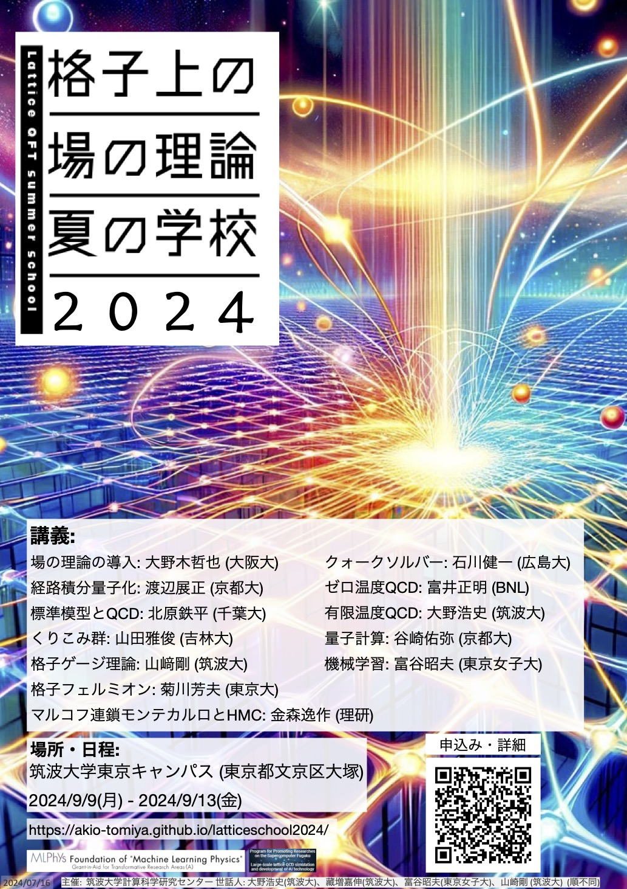

## 概要 

格子上の場の理論は、場の量子論を非摂動論的に定義・計算する手法であり、
素粒子物理学の中でも大きな分野となっています。
この夏の学校は、約10年ぶりに日本で開催される大型の格子ゲージ理論・格子上の場の理論のサマースクールです。
格子上の場の理論の基本概念、枠組み、アルゴリズムの開発、および応用の最前線に触れ、
格子QCD分野への入門を行いたいと考えており、また、若手同士の幅広い交流も目的とします。
場の理論および格子QCDに関心を持つ修士および博士課程の学生・若手研究者を主な対象としていますが、
上記テーマに興味をお持ちの方でしたらどなたでも歓迎いたします。

## 場所と日程

- [筑波大学東京キャンパス (東京都文京区大塚)](https://www.office.otsuka.tsukuba.ac.jp/location/) 134講義室
- 開催期間: 2024/9/9(月)-2024/9/13(金)

## トピックと講師

1. 場の理論の導入: 大野木哲也 (大阪大)
3. 経路積分量子化: 渡辺展正 (京都大)
4. 標準模型とQCD: 北原鉄平 (千葉大)
5. くりこみ群: 山田雅俊 (吉林大)
6. 格子ゲージ理論: 山﨑剛 (筑波大)
7. 格子フェルミオン: 菊川芳夫 (東京大)
8. マルコフ連鎖モンテカルロとHMC: 金森逸作 (理研)
9. クォークソルバー: 石川健一 (広島大)
10. ゼロ温度QCD: 富井正明 (BNL)
11. 有限温度QCD: 大野浩史 (筑波大)
12. 量子計算: 谷崎佑弥 (京都大)
13. 機械学習: 富谷昭夫 (東京女子大)
14. ハンズオン: 永井佑紀 (東大)

(敬称略)

## 時間割 (暫定)

|               | 9/9 (月)                 | 9/10 (火)                | 9/11 (水)        | 9/12 (木) | 9/13 (金)        |
| --------------| ------------------------ | ------------------------ | ---------------- | --------- | ---------------- |
| 10:00 - 11:30 | -                        | 経路積分                  | 格子ゲージ理論    | CG solver | 有限温度         |
| 11:30 - 13:30 | 受付・開校式 (10分程度)    | -                        | 写真撮影          | -         | -               |
| 13:30 - 15:00 | 場の理論の導入I: 群と表現  | 標準模型とQCDの基礎       | 格子フェルミオン  | ゼロ温度   | 量子コンピュータ |
| 15:30 - 17:00 | 場の理論の導入II: ハミルトン形式の場の理論   | くりこみ群と連続極限       | MCMCとHMC        | ハンズオン    | 機械学習        |
| 17:00 -       | -                        | グループセミナー (17:20-) | 懇親会 (18:30-) | -         | 閉校式 (10分程度) |

※ 講義の時間は今後変更になることがあります。

## グループセミナー

学生の現地参加者の皆さんの交流の場として、以下の通り、グループセミナーを開催します。

- 日時: 9/10 (火) 17:20 - 18:00 (第一部)、18:10 - 18:50 (第二部)
- 会場: 講義会場と同じ (オンラインでは参加いただけません)
- 内容:
  - 数名のグループに分かれて5分程度の発表・質疑を順番に行う。
  - 発表はグループメンバーを変更して2回行う。
  - 発表内容は本スクールの趣旨に沿ったものであれば基本的に自由。自己紹介と交流が主な目的。例えば、
    - 過去・現在の自分の研究の紹介
    - 興味を持っている研究のレビュー
    - 漠然と将来研究したいと思っていること
    - 先輩に聞いてみたいこと
    - etc...
  - 発表形式: 発表内容をスライド1ページにまとめたものを共有 (スライドの提出方法は以下で説明)

学部生から博士課程院生まで幅広い方が気軽に参加できるよう、発表内容の自由度を高く設定しました。
和気あいあいとした雰囲気で行いたいと思いますので、ぜひ参加をお願いいたします。

参加される方は、別途連絡する要領に従って参加登録をお願いいたします。

多くの皆さんの参加をお待ちしています。

## ハンズオン
9/12 (木)　15:30　よりハンズオンを行います。[LatticeQCD.jl](https://github.com/akio-tomiya/LatticeQCD.jl)
を用いて実際に計算をやってみます。3部構成で以下のように行いたいと思います。
参加したい方は、パソコンを持ってください。

1.Julia のインストール、Jupyter の立ち上げ (永井)
2.LatticeQCD.jlの概要 (初心者向け、富谷)
LatticeQCD.jl をJupyter notebook で走らせます。
そしてQuenched QCDの配位を熱浴法で生成しπ中間子の質量を計算してみます。
3.Gaugefields.jl を少しいじってみる (玄人向け、富谷永井)
　実際にQuenched QCD (heatbath/HMC)のコードを打ち込んでみて、
　Polyakov loop の散布図を見てみるなどを考えてみます。

18時までなら教室を使えるので、残ってやりたい人は
17時以降もしばらく続けてもらうことが可能です。

## 旅費補助

以下の通り、学生に対する旅費補助を行います。

- <strike>宿泊費: 9,200円/泊 (定額)</strike> **申し込み多数により減額とさせていただきます**
- 上限: 一人当たり総額8万円程度
- 学振や研究室等の財源がある方はご遠慮ください。
- 財源の都合により、ご希望に添えない場合があります。補助の可否が決定しましたらご連絡します。
- 補助を受ける場合、事務手続きに必要な書類は、速やかにご提出ください。

<!-- 旅費補助が必要な方は、参加登録時にお申し込みください。 -->
旅費補助の申請は締め切りました。

## 参加登録

以下のフォームよりご登録ください。

[参加登録フォーム](https://docs.google.com/forms/d/e/1FAIpQLSfxUwIXTVrIvYWDBsk2b3IIpHtz3hXQ4GAowKYteTZibS4nIg/viewform)

### 締切

- 対面参加: 登録を締め切りました。
  - 旅費補助必要: 2024/7/7 (日) 23:59 JST
  - 旅費補助不要: 2024/8/18 (日) 23:59 JST
  - 会場の定員に達し次第、対面参加の受付は締め切らせていただきます。
- オンライン参加:
  - 随時参加登録可能

## ポスター

研究室に掲示して告知していただけると幸いです。

[高画質PDF](poster_pub_Jul16.pdf)

## お問い合わせ

以下のフォームよりお問い合わせください。

[お問い合わせフォーム](https://docs.google.com/forms/d/e/1FAIpQLSdOvVRKiCXZDkzK88uwUoM_Yh7_jXrhilbDV42swc4BHICBbA/viewform)

## 主催

筑波大学計算科学研究センター

## 世話人

大野浩史、藏増嘉伸、富谷昭夫、山崎剛 (順不同)

-----

本スクールは、
「富岳」成果創出加速プログラム JPMXP1020230409「超大規模格子QCDによる新物理探索と次世代計算に向けたAI技術開発」、
学術変革領域研究(A) KAKENHI 22A202「学習物理学の創成」、 
学術変革領域研究(A) KAKENHI 24H00940「テンソル繰り込み群による場の理論におけるエンタングルメント・エントロピーの研究」、
基盤研究(A) KAKENHI 24H00214「テンソルネットワークが拓く計算素粒子物理学の新たな展開」、 
基盤研究(B) KAKENHI 23K25891「素粒子標準模型を超える物理探索に向けた格子QCD精密化」
からの補助を受けています。
