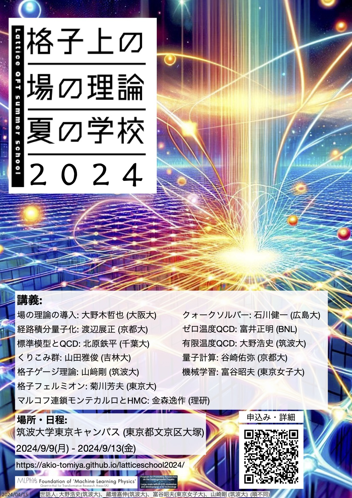

## 概要 

格子上の場の理論は、場の量子論を非摂動論的に定義・計算する手法であり、
素粒子物理学の中でも大きな分野となっています。
この夏の学校は、約10年ぶりに日本で開催される大型の格子ゲージ理論・格子上の場の理論のサマースクールです。
格子上の場の理論の基本概念、枠組み、アルゴリズムの開発、および応用の最前線に触れ、
格子QCD分野への入門を行いたいと考えており、また、若手同士の幅広い交流も目的とします。
場の理論および格子QCDに関心を持つ修士および博士課程の学生・若手研究者を主な対象としていますが、
上記テーマに興味をお持ちの方でしたらどなたでも歓迎いたします。

## 場所と日程

- [筑波大学東京キャンパス (東京都文京区大塚)](https://www.office.otsuka.tsukuba.ac.jp/location/)
- 開催期間: 2024/9/9(月)-2024/9/13(金)

## トピックと講師

1. 場の理論の導入: 大野木哲也 (大阪大)
3. 経路積分量子化: 渡辺展正 (京都大)
4. 標準模型とQCD: 北原鉄平 (千葉大)
5. くりこみ群: 山田雅俊 (吉林大)
6. 格子ゲージ理論: 山﨑剛 (筑波大)
7. 格子フェルミオン: 菊川芳夫 (東京大)
8. マルコフ連鎖モンテカルロとHMC: 金森逸作 (理研)
9. クォークソルバー: 石川健一 (広島大)
10. ゼロ温度QCD: 富井正明 (BNL)
11. 有限温度QCD: 大野浩史 (筑波大)
12. 量子計算: 谷崎佑弥 (京都大)
13. 機械学習: 富谷昭夫 (東京女子大)

(敬称略)

## 時間割

|       | 9/9 (月)                 | 9/10 (火)            | 9/11 (水)        | 9/12 (木) | 9/13 (金)        |
| ----- | ------------------------ | -------------------- | ---------------- | --------- | ---------------- |
| 午前  | -                        | 経路積分             | 格子ゲージ理論   | CG solver | 有限温度         |
| 昼    | 開校式                   | -                    | 写真撮影         | -         |                  |
| 午後1 | 群と表現 | 標準模型とQCDの基礎  | 格子フェルミオン | ゼロ温度  | 量子コンピュータ |
| 午後2 | ハミルトン形式の場の理論                 | くりこみ群と連続極限 | MCMCとHMC        | (未定)    | 機械学習         |
| 午後3/夜 |                          | -                    | 懇親会           | -         | 閉校式           |

※ 調整中です。

## 旅費補助

以下の通り、学生に対する旅費補助を行います。

- 宿泊費: 9,200円/泊 (定額)
- 上限: 一人当たり総額8万円程度
- 学振や研究室等の財源がある方はご遠慮ください。
- 財源の都合により、ご希望に添えない場合があります。補助の可否が決定しましたらご連絡します。
- 補助を受ける場合、事務手続きに必要な書類は、速やかにご提出ください。

~旅費補助が必要な方は、参加登録時にお申し込みください。~  
旅費補助の申請は締め切りました。

## 参加登録

以下のフォームよりご登録ください。

[参加登録フォーム](https://docs.google.com/forms/d/e/1FAIpQLSfxUwIXTVrIvYWDBsk2b3IIpHtz3hXQ4GAowKYteTZibS4nIg/viewform)

### 締切

- 対面参加:
  - 旅費補助必要: 2024/7/7 (日) 23:59 JST
  - 旅費補助不要: 2024/8/18 (日) 23:59 JST
  - 会場の定員に達し次第、対面参加の受付は締め切らせていただきます。
- オンライン参加:
  - 随時参加登録可能

## ポスター

研究室に掲示して告知していただけると幸いです。

[高画質PDF](poster_pub_Apr15.pdf)

## お問い合わせ

以下のフォームよりお問い合わせください。

[お問い合わせフォーム](https://docs.google.com/forms/d/e/1FAIpQLSdOvVRKiCXZDkzK88uwUoM_Yh7_jXrhilbDV42swc4BHICBbA/viewform)

## 世話人

- 大野浩史、藏増嘉伸、富谷昭夫、山崎剛 (順不同)

## 
本スクールは、科学研究費補助金学術変革領域研究(A)「学習物理学の創成」、 
「富岳」成果創出加速プログラム「超大規模格子QCDによる新物理探索と次世代計算に向けたAI技術開発」
<!-- 
基盤研究(A)「」、 
基盤研究(B)「」
-->
からの補助を受けています。
